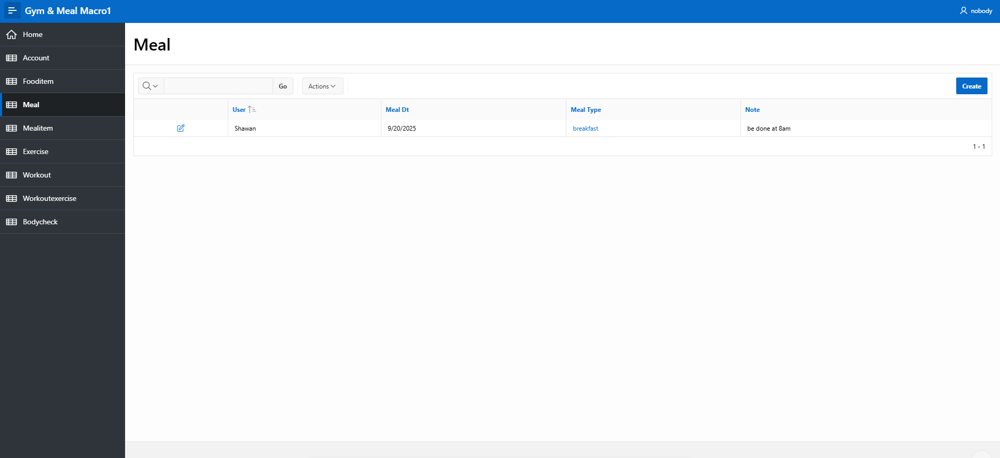

# Gym & Meal Macro Tracker

A SQL + Oracle APEX project to track meals, workouts, and progress.

## Features
- User accounts with daily targets (protein, kcal).
- Meals + Food items with nutrition values.
- Automatic macro calculations (protein, carbs, fats, kcal).
- Workout logging (sets, reps, weights).
- Body check log (weight, body fat%).
- APEX interactive reports & dashboards.

## Tech Stack
- Oracle SQL (DDL, triggers, sequences, views)
- Oracle APEX (forms, reports, charts)

## Demo Screenshots

## How to Run
1. Run `schema.sql` in Oracle SQL Workshop.
2. Run `sample_data.sql` for demo data.
3. Import views and triggers.
4. Deploy APEX pages (forms + reports).
